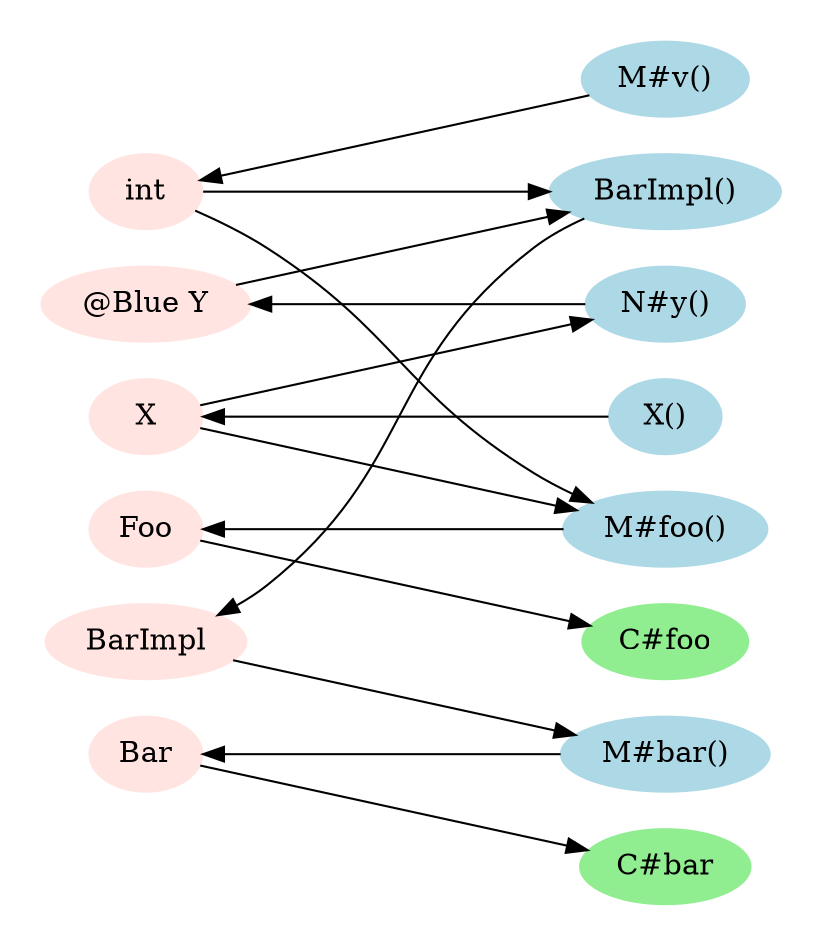

# Dagger Core Semantics

This series of documents describes the semantics of Dagger. It's not intended
for learning *how* to use Dagger, but rather for *what* Dagger is.


-   Core Dagger (this document)
-   [Advanced Dagger](advanced.md)
-   [Dagger Producers](producers.md)

Dagger is roughly divided into a "core", plus several extensions. This document
describes the core, and subsequent documents describe the extensions.

Topics are presented incrementally; initially, we present a simplified view of
Dagger, and as we introduce new topics, we'll note where previous statements
must be amended.

[TOC]

## Keys

A **qualifier** is a Java annotation that's annotated `@Qualifier`. For example,

```java
@Qualifier
@interface Blue {}

@Qualifier
@interface Name {
  String value();
}
```

define qualifiers.

We also use the term qualifier for the concrete use of the qualifier in code.
For example:

```
@Name("Aaron")
@Name("Brett")
```

are two different instantiations of the qualifier `@Name`. It is usually clear
from context whether "qualifier" means the annotation definition or
instantiation.

A **key** is a pair of a Java type and an optional qualifier instantiation. For
example,

```java
int
@Blue Foo
@Name("Giannis") Map<Integer, String>
```

are all keys.

We often refer to a key as `@Q T`; by this, we mean that `Q` is a qualifier and
`T` is a type.

Two keys are the **same** if their types are the same, up to unboxing, and their
qualifiers are the same. For example,

```java
@Blue int
@Blue Integer
```

are the same, but

```java
@Green int
```

is different from both.

It is always an error to apply multiple qualifiers to the same type.

## Bindings

A **binding** is a function that tells Dagger how to compute an instance of a
binding key (which is essentially the return type of the method; see below). It
can be either **user-defined** or **synthetic**:

A **user-defined** binding is a Java method that is:

-   A non-abstract method annotated `@Provides`
-   An abstract method annotated `@Binds`, which has exactly one argument, and
    the argument is convertible to the return type
-   A constructor annotated `@Inject`

These are the basic user-defined bindings; other Dagger features like
[multibindings](advanced.md#multibindings) and [producers](producers.md)
introduce new kinds of user-defined bindings.

A **synthetic** binding is a binding that Dagger generates, subject to
constraints that will be discussed later.

### Signatures

Recall that the signature of a Java method describes the inputs and outputs of
that methods; these inputs and outputs are, of course, Java types. Sometimes
this signature is considered to include annotations, and sometimes it's not; in
our case, we want to consider the annotations on method parameters, and on the
method itself, as part of the Java signature. For example,

```java
// Java signature = (@Blue Set<Bar>, @Nullable Provider<Integer>) -> @Nullable Foo
@Nullable Foo foo(@Blue Set<Bar> setOfBar, @Nullable Provider<Integer> i);
```

This signature induces a **key signature**, that is, a signature where the
inputs and outputs are Dagger keys, as follows.

First, we compute the **declared key signature** by simply dropping all
annotations that are not qualifiers. For example:

```java
// declared key signature = (@Blue Set<Bar>, Provider<Integer>) -> Foo
@Nullable Foo foo(@Blue Set<Bar> setOfBar, @Nullable Provider<Integer> i);
```

Then, we form the key signature by unwrapping arguments that are `Provider<T>`,
`Lazy<T>`, or `Provider<Lazy<T>>`. For example:

```java
// key signature = (@Blue Set<Bar>, int) -> Foo
@Nullable Foo foo(@Blue Set<Bar> setOfBar, @Nullable Provider<Integer> i);
```

The output key is called the **binding key** and the input keys are called
**dependency keys**; we'll sometimes refer to the **declared binding key** or
**declared dependency keys**, which are the output and inputs keys of the
declared key signature.

Note: For `@Inject` constructors, we treat the return type of the Java signature
as the type of the constructor's class. Unlike the other binding methods,
`@Inject` constructors' binding keys cannot have qualifiers.

Here are some more examples of key signatures:

```java
// key signature = (int) -> Foo
@Provides Foo foo(int x) { ... }

// key signature = (FooImpl) -> @Green Foo
@Binds @Green abstract Foo greenFoo(FooImpl impl);

// key signature = () -> int
@Provides int count() { return 5; }

// key signature = (Bar) -> Foo
class Foo {
  @Inject
  Foo(Bar bar) { ... }
}

// key signature = (Bar, @Blue Baz, @Green int) -> Foo
@Provides Foo foo(
    Bar bar, @Blue Baz baz, @Green Provider<Integer> greenIntProvider) { ... }
```

### Binding Logic

The **binding logic** of a binding is the function that the binding represents.
It is a (possibly fictitious) Java function with the same signature as the
binding, except ignoring qualifiers.

Of the bindings discussed so far:

-   the binding logic of a `@Provides` method is the method itself;
-   the binding logic of a `@Binds` method is the identity function;
-   the binding logic of an `@Inject` constructor is the constructor itself,
    thinking of it as a function from its arguments to the class type;

## Modules

A **module** is a class annotated `@Module`, which contains zero or more
`@Provides` or `@Binds` methods; these methods are the **bindings** of the
module.

For the purposes of this initial exposition, modules may not have instance
methods or fields. In the
[Parameterization](#parameterization-component-builders) section, they will be
allowed to have instance methods or fields, but this is generally discouraged.

Modules may **include** other modules via the `includes` field on their
annotation. The **transitive closure** of a module is the transitive set of
modules that are included by that module, and the **transitive bindings** of a
module is the union of all bindings in modules in the transitive closure.

## Components

A **component** is an interface or abstract class annotated `@Component`.

**Dagger will generate implementations of components.**

The **modules** of a component are the transitive closure of the list of modules
specified in the `modules` field on its annotation.

The **entry points** of the component are the abstract, zero-arg, non-void
methods on the interface or abstract class. It is an error to have any abstract
methods that have arguments or are void. The **entry point key** is defined
analogously to a binding key, that is, the key associated with its return type.

The **bindings** of a component are the union of the set of bindings in all of
the component's modules.

Here is a complete example with all of the features described so far:

```java
@Qualifier @interface Blue {}

@Module(includes = N.class)
abstract class M {
  @Provides static int v() { ... }
  @Provides static Foo foo(X x, int v) { ... }
  @Binds abstract Bar bar(BarImpl impl);
}

@Module
final class N {
  @Provides @Blue static Y y(X x) { ... }
}

class X {
  @Inject
  X() { ... }
}

class BarImpl {
  @Inject
  BarImpl(@Blue Y y, int v) { ... }
}

@Component(modules = M.class)
interface C {
  Foo foo();
  Bar bar();
}
```

In the above example:

- The component `C` has modules `{M, N}`;
- Its bindings are:
  - `M#v` (signature = `() -> int`)
  - `M#foo` (signature = `X, int -> Foo`)
  - `M#bar` (signature = `BarImpl -> Bar`)
  - `N#y` (signature = `X -> @Blue Y`)
  - `BarImpl` (signature = `@Blue Y, int -> BarImpl`)
- Its entry points are:
  - `C#foo` (key = `Foo`)
  - `C#bar` (key = `Bar`)

## Resolution: Construction of the Graph

Dagger constructs a bipartite graph for each component.

The *nodes* of the graph are:

-   bindings and entry points of the component
-   binding keys and dependency keys of those bindings, and all entry point
    keys.

The *edges* of the graph are directed edges consisting of:

-   for each binding, an edge from its dependency keys to the binding; this
    models **dependencies of bindings**;
-   for each entry point, an edge from the entry point's key to the entry point;
    this models **dependencies of entry points**;
-   for each key, an edge to the key from any binding that has this key as its
    binding key; this models **resolution of keys**.

The graph is **well-formed** if:

-   every key node has exactly one inbound edge;
-   there are no cycles, with the following exception: if a cycle contains an
    edge representing a dependency key whose type was wrapped in `Provider` or
    `Lazy`, then it is permitted.

If a key node has zero inbound edges, it is a **missing binding**; if it has
more than one inbound edge, it is a **duplicate binding**.

The above example component generates the following graph. The key nodes are
light red, the binding nodes are light blue, and the entry point nodes are light
green.



## Code Generation and Runtime

Given a well-formed graph of a component, Dagger generates an implementation for
that component interface, which has the following runtime behavior.

### Implementing the Component

Dagger generates an implementation of the component in the same package as the
component, whose name is prefixed with `Dagger`. If the component was a nested
class, named `C1.C2...Cn`, then the generated implementation replaces dots with
underscores: `DaggerC1_C2_..._Cn`.

The generated component class has a private zero-arg constructor, and Dagger
will generate a special public method `#create()` that constructs the component.

For each entry point, Dagger will resolve it by following the graph along
reverse edges, which will produce a subset of the graph.

Assume first that this is an acyclic graph with no binding methods that take
`Provider` or `Lazy`. Beginning with the roots of this subgraph, Dagger will
execute the **binding logic** for each binding, passing the result of each
computation into the subsequent binding. If one binding is used by several
others, its binding logic will be re-evaluated *each time* it is needed. When
Dagger reaches the terminal point of this process (the entry point), Dagger
returns the value it has computed.

In the earlier example, Dagger will generate code that roughly looks like

```java
public final class DaggerC implements C {
  private DaggerC() {}

  public static C create() {
    return new DaggerC();
  }

  @Override
  public Foo foo() {
    return new Foo(new X(), M.v());
  }

  @Override
  public Bar bar() {
    return new BarImpl(N.y(new X()), M.v());
  }
}
```

Note that `M.v()` is called twice, once for each place it's used.

### Provider and Lazy

If a binding method has an argument of `Provider`, then instead of actually
*executing* the binding logic, Dagger will generate a class that defers the
computation of that logic and all of its dependencies. For example, suppose in
the earlier example that the constructor for `BarImpl` was:

```java
class BarImpl {
  @Inject
  BarImpl(@Blue Provider<Y> y, int v) { ... }
}
```

Dagger might generate code looking like:

```java
public final class DaggerC implements C {
  ... // as before

  @Override
  public Bar bar() {
    return new BarImpl(() -> N.y(new X()), M.v());
  }
}
```

If a binding method has an argument of `Lazy`, then similarly, Dagger will
generate a class that defers the computation of that logic and all of its
dependencies, and caches the result. For example, suppose in the example that
the constructor for `BarImpl` was:

```java
class BarImpl {
  @Inject
  BarImpl(@Blue Lazy<Y> y) { ... }
}
```

Dagger might generate code looking like:

```java
public final class DaggerC implements C {
  ... // as before

  @Override
  public Bar bar() {
    return new BarImpl(DoubleCheck.provider(() -> N.y(new X())), M.v());
  }
}
```

where [DoubleCheck][double check] is a Dagger utility class that caches the
result of a provider call.

Note: Dagger will construct a new `Lazy` instance every time it is requested; so
although `Lazy` itself caches its contents, if multiple bindings request a
`Lazy` of the same type, they'll get different instances.

[double check]: https://github.com/google/dagger/blob/bbb4bfd2bd0c27b884d0c01795b588f2bf1cb685/java/dagger/internal/DoubleCheck.java

### Cycles

If a well-formed graph has a cycle, then necessarily the cycle contains an
argument to a binding that is a `Provider` or `Lazy`. In this case, the
implementation of this cycle can be broken with an extra layer of indirection:
Dagger starts by constructing a dummy version of that `Provider` or `Lazy`,
continuing around the cycle by making providers (never actually executing any
binding logic), until it reaches the end of the cycle and it fills in the
original `Provider`.

For example:

```java
@Module
final class M {
  @Provides static A a(Provider<C> c) { return new A(); }
  @Provides static B b(A a) { return new B(); }
  @Provides static C c(B b) { return new C(); }
}

@Component(modules = M.class)
interface X {
  A a();
}
```

Dagger might generate code that looks like:

```java
public final class DaggerX implements X {
  @Override
  public A a() {
    DelegateProvider<A> a = new DelegateProvider<>();
    Provider<B> b = () -> M.b(a.get());
    Provider<C> c = () -> M.c(b.get());
    a.setDelegate(() -> M.a(c));
    return a.get();
  }
}
```

### Exceptions

Exceptions are not caught by Dagger. Since Dagger generates code that is
essentially composition of functions, if any binding's logic throws an
exception, then it will propagate out to the caller of the entry point.

The one exception to this behavior is with `Provider` or `Lazy`; since both of
these types defer computation, if a binding's logic throws an exception in some
ancestor dependency of a `Provider` or `Lazy` injection, then the `get()` method
will throw that exception, and the user could catch it there. However, it's
often considered a code smell to catch exceptions this way, since binding
methods should rarely throw exeptions.

## Parameterization: Component Builders

So far, a component is self-contained: it can be constructed at runtime with no
arguments.

Dagger allows components to be **parameterized**: new bindings can be added to
the component whose logic is passed at runtime, to a "component builder", before
constructing the component.

The **builder** of a component is an interface or abstract class annotated
`@Component.Builder`, that's nested inside a component.

Component builders must have a **build method**, which is an abstract zero-arg
method returning the component.

All other abstract methods on the builder must be **setter methods**, that is,
single-arg methods returning the builder class itself. There are three kinds of
setter methods, which will be discussed separately.

### Bound instances

A **bound instance** is the argument of a builder setter method annotated with
`@BindsInstance`. This binds the value of the instance passed at runtime to the
declared key of the argument; that is, it generates a binding.

A **bound instance binding** is a user-defined binding for each of the
`@BindsInstance` methods on the component builder; with

-   key signature is `component -> declared key of the single argument`
-   binding logic returning the bound instance from the component;

When bound instance bindings are present, we need a special synthetic binding to
represent the component, whose

-   key signature is `() -> component`; and
-   binding logic returns the `this` of the generated implementation of the
    component.

Here is a complete example with bound instances:

```java
@Qualifier @interface Blue {}

@Module(includes = N.class)
abstract class M {
  @Provides static Foo foo(X x, int v) { ... }
  @Binds abstract Bar bar(BarImpl impl);
}

@Module
final class N {
  @Provides @Blue static Y y(X x) { ... }
}

class BarImpl {
  @Inject
  BarImpl(@Blue Y y, int v) { ... }
}

@Component(modules = M.class)
interface C {
  Foo foo();
  Bar bar();

  @Component.Builder
  interface B {
    @BindsInstance B x(X x);
    @BindsInstance B v(int v);
    C build();
  }
}
```

In the above example:

- The component `C` has modules `{M, N}`;
- Its bindings are:
  - synthetic binding for bound instance `B#x` (signature = `C -> X`)
  - synthetic binding for bound instance `B#v` (signature = `C -> int`)
  - user-defined `M#foo` (signature = `X, int -> Foo`)
  - user-defined `M#bar` (signature = `BarImpl -> Bar`)
  - user-defined `N#y` (signature = `X -> @Blue Y`)
  - user-defined `BarImpl` (signature = `@Blue Y, int -> BarImpl`)
  - synthetic binding for `C` (signature = `() -> C`)
- Its entry points are:
  - `C#foo` (key = `Foo`)
  - `C#bar` (key = `Bar`)

### Resolution and Runtime

Dagger generates a builder class that is a standard Java builder: it collects
all of the bound instances passed to it; and then constructs a component object,
which passes references to all of those instances to the constructor of the
component.

Dagger generates a component class that maintains references to all of these
instances passed by the builder. These references describe the bound instance
bindings on the component; i.e., the binding for a bound instance, which has
signature `component -> some bound instance key`, is just a field lookup on the
component for that instance.

Moreover, note that all generated code below is inside the component itself;
therefore, every method has access to the component instance itself (via the
`this` parameter).

Finally, Dagger generates a public static method `#builder()` that constructs
the component builder.

For the earlier example, Dagger would generate code that roughly looks like:

```java
public final class DaggerC implements C {
  private final X x;
  private final int v;

  private DaggerC(X x, int v) {
    this.x = x;
    this.v = v;
  }

  @Override
  public Foo foo() {
    return new Foo(x, v);
  }

  @Override
  public Bar bar() {
    return new BarImpl(N.y(x), v);
  }

  public static B builder() {
    return new Builder();
  }

  static final class Builder implements B {
    private X x;
    private int v;

    @Override
    public B x(X x) {
      this.x = checkNotNull(x);
      return this;
    }

    @Override
    public B v(int v) {
      this.v = v;
      return this;
    }

    @Override
    public C build() {
      return new DaggerC(checkNotNull(x), v);
    }
  }
}
```

### Component dependencies

The **dependencies** of a component are the classes listed in the component's
`dependencies` field of its annotation. These classes may be arbitrary classes,
but what Dagger cares about is the zero-arg non-void instance methods, whose
return types will be bound.

When a component dependency is listed in the component annotation, it must have
a corresponding setter method in the component builder.

Component dependencies add two new kinds of bindings:

-   A **component dependency method binding** is a non-void, zero-arg method on
    component dependency; with
    -   key signature `component dependency -> declared key of the return type
        of the method`
    -   binding logic is the method itself
-   A **component dependency binding** is a synthetic binding for a component
    dependency; with
    -   key signature `component -> component dependency`; and
    -   binding logic returning a component dependency instance from the
        component;

Component dependencies are simply syntactic sugar for a certain use case for
bound instances. Suppose that we have the following interface:

```java
interface D {
  @Q1 T1 t1();
  ...
  @Qn Tn tn();
  // possibly other, non-void or non-zero-arg methods
}
```

Then specifying `D` as a component dependency as follows:

```java
@Component(dependencies = D.class, modules = ...)
interface C {
  ...

  @Component.Builder
  interface B {
    B d(D d);
    ...
    C build();
  }
}
```

is equivalent to writing a module:

```java
@Module
final class DModule {
  @Provides @Q1 static T1 t1(D d) { return d.t1(); }
  ...
  @Provides @Qn static Tn tn(D d) { return d.tn(); }
}
```

and binding `D` as an instance:

```java
@Component(dependencies = D.class, modules = {DModule.class, ...})
interface C {
  ...

  @Component.Builder
  interface B {
    @BindsInstance B d(D d);
    ...
    C build();
  }
}
```

This is really truly equivalent: not only does it produce the same graph of
bindings, but it also provides clients with the same runtime API for the
component and its builder.

### Module instances

When modules were presented earlier, they were not allowed instance methods or
fields. We now describe a way that Dagger does allow modules to have instance
methods or fields.

Warning: it's discouraged for modules to have state; this can lead to
unpredictable behavior. Moreover, module instances in general are rarely useful.
We have considered removing them.

If a builder setter method specifies a module, then Dagger generates a new
binding:

A **module binding** is a synthetic binding for a module; with

-   key signature `component -> module`; and
-   binding logic returning a module instance from the component;

Then, given a binding in that module that is an instance method, Dagger treats
its signature's first argument as the module itself (i.e., the `this` parameter
of the module).

Warning: module bindings are not allowed to be injected by user code; it is only
a figment of Dagger's imagination.

Module instances are also redundant with bound instances. Any instance fields of
a module can be bound directly as instances, so that instance methods that refer
to them can inject those types directly, and hence can be static methods.

<!-- TODO(beder): Add example of this redundancy. -->
